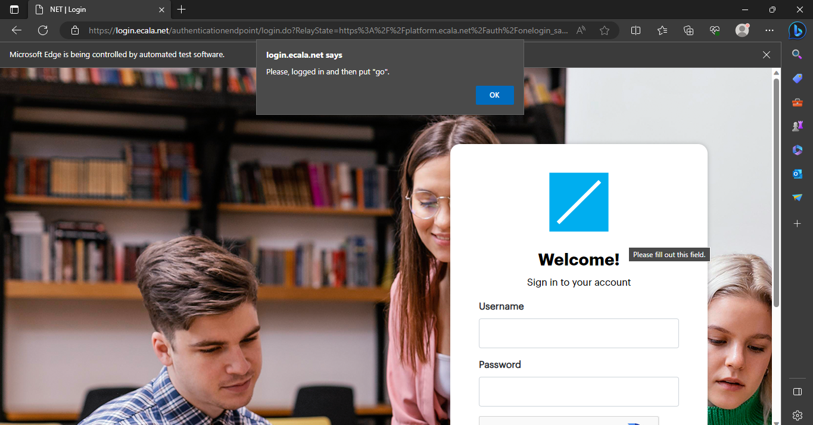
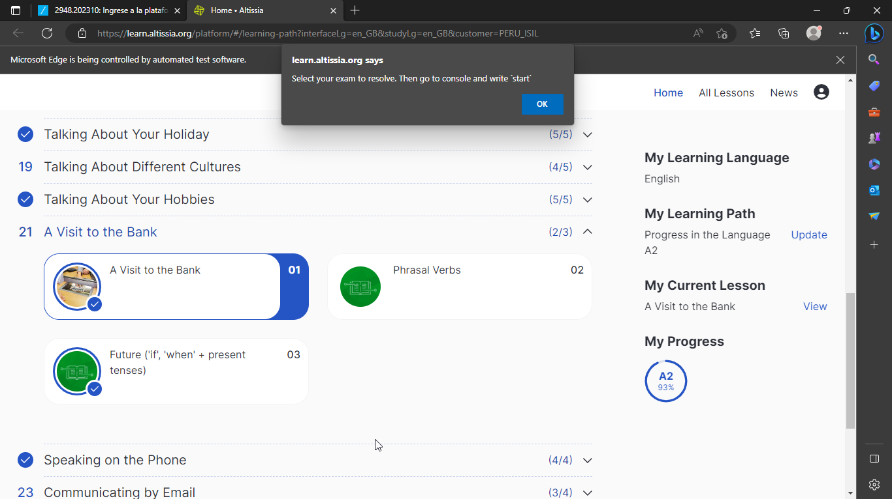
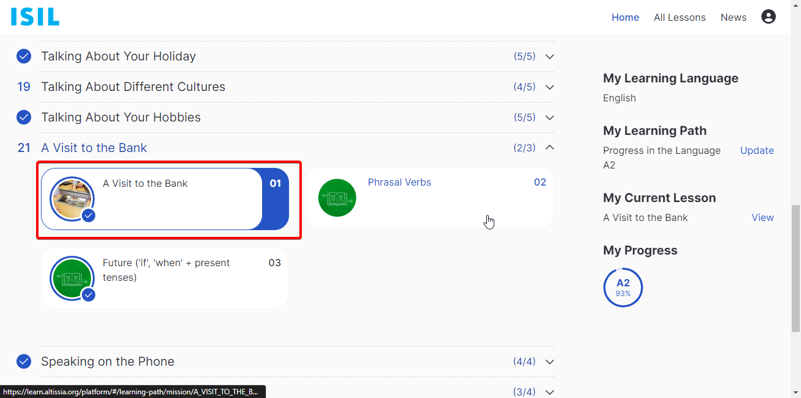
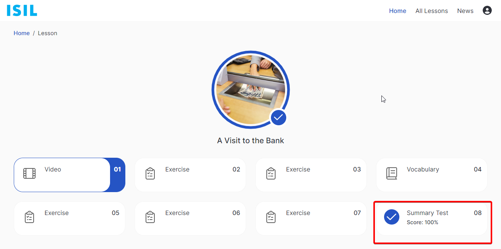
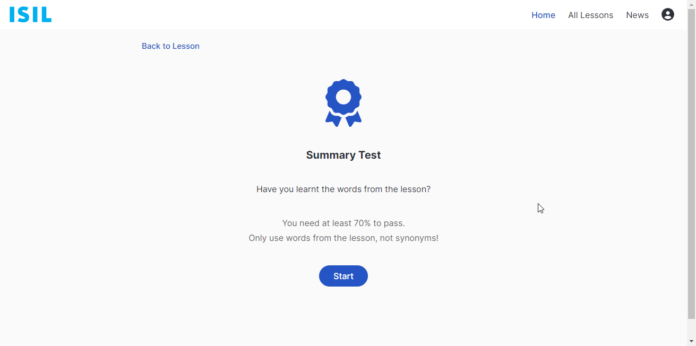
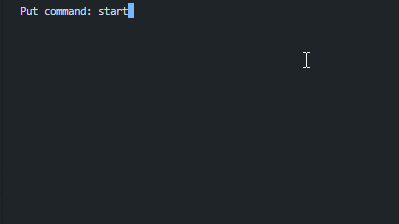
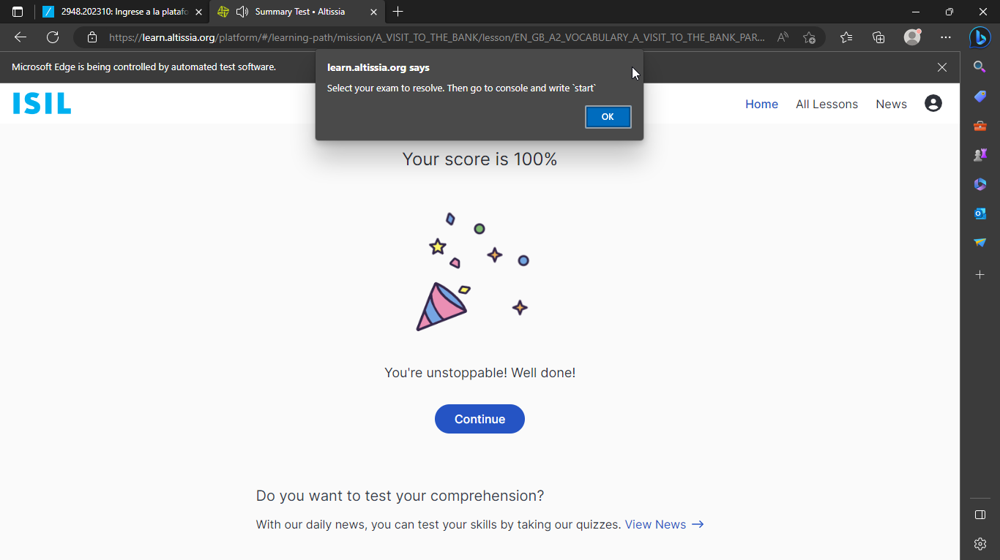

# Altissia exams - ISIL
An console app to make Altissia exams (from ISIL) automatically. 
> **WARNING:** Only apply for [ISIL](https://isil.pe) students, by now

## Table of Contents 
* [General Info](#general-information)
* [Technologies Used](#technologies-used)
* [Features](#features)
* [Setup](#setup)
* [Usage](#usage)
* [Room for Improvement](#room-for-improvement)
* [Contact](#contact)
<!-- * [License](#license) -->

## General Information

### What is the purpose of this project?
Well, this project was born in order to do the Altissia exams in an automated way, because his process is soo repetitive it's boring.

## Technologies Used
- .NET 7
- Selenium

## Features
You can:
- Make the exams do you one (I repet: **only exams**)

## Setup

### Prerequisites
- You need to have the [Microsoft NET Core App Runtime](https://dotnet.microsoft.com/en-us/download/dotnet/7.0) Version 7.0 +, or only the .NET 7 SDK.
- Edge Browser (You can change your preference browser to open the app changing the web driver in the code)

### Compile
1. Clone this repo: `git clone https://github.com/omargtdev/altissia-automated-exams`
2. Go to the project folder and run: `dotnet build`

## Usage

- You need to stablish the url of course and your credentials to be able to start in the file `appsettings.example.json`:
```json
{
  "CourseUrl": "<YOUR-URL-OF-IDIOMA-EXTRANJERO-COURSE>"
}
```
- Then rename the file to `appsetings.json`
- Run the app (inside the project) with `dotnet run`
- Wait until the browser open automatically, and notify you to log 
in:



- Then, you need to continue in the terminal with 'go' command.
- After that, you need to wait to altissia main page.



- Once you are there, please enter to an exam page, like this:







- Go to the console where did you run the app, and put the `start` command. 
There are 2 commands: 
  - `start` to start an exam 
  - `exit` to end the app.



- And wait for it to finish and if you want, go to another course.



## Room for Improvement
Well, nothing is perfect. Sometimes, if the connection of internet is too poor, 
it breaks because the program is finding an specefic element in the browser to interactive with him.
Also, when you put the `start` command, you must be in a exam start page otherwise it breaks too.

To do:
- [ ] Show an message to warn the process fails beacuse the internet is too low
- [X] Add validation to command `start`. When the user is not on a exam page, display an alert
- [ ] Add preference browser to select

## Contact
Created by [@omargtdev](https://www.github.com/omargtdev)
